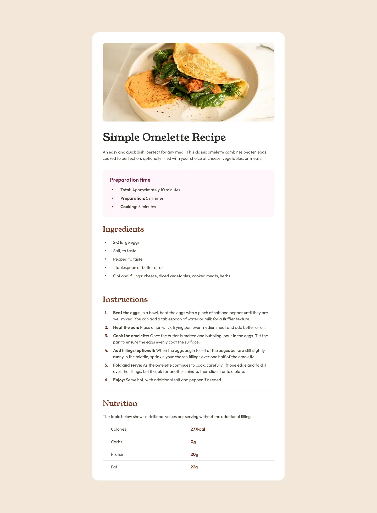
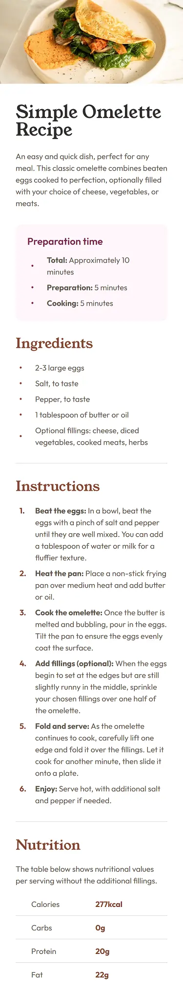

# Frontend Mentor - Recipe page solution

This is a solution to the [Recipe page challenge on Frontend Mentor](https://www.frontendmentor.io/challenges/recipe-page-KiTsR8QQKm). Frontend Mentor challenges help you improve your coding skills by building realistic projects.

## Table of contents

- [Overview](#overview)
  - [The challenge](#the-challenge)
  - [Screenshot](#screenshot)
  - [Links](#links)
- [My process](#my-process)
  - [Built with](#built-with)
  - [Useful resources](#useful-resources)
- [Author](#author)

## Overview

### The challenge

Users should be able to:

- View the optimal layout for the site depending on their device's screen size

### Screenshot

### Links

- Solution URL: [click-me](https://github.com/OniOdd/recipe-page)
- Live Site URL: [click-me](https://oniodd.github.io/recipe-page/)

## My process

### Built with

- Semantic HTML5 markup
- CSS custom properties
- Mobile-first workflow
- BEM

### Useful resources

- [MDN Web Docs](https://developer.mozilla.org/) - A useful informative resource.
- [Code Guide](https://codeguide.co/) - Standards for developing consistent, flexible, and sustainable HTML and CSS.

## Author

- LinkedIn - [Mykyta Kavetskyi](https://www.linkedin.com/in/mykyta-kavetskyi/)
- Facebook - [Mykyta Kavetskyi](https://www.facebook.com/profile.php?id=100094490807763)
- Twitter - [@OniOdd](https://twitter.com/OniOdd)
- Frontend Mentor - [@OniOdd](https://www.frontendmentor.io/profile/OniOdd)
